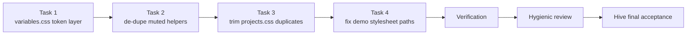

# css-purpose-audit — Make the CSS files serve their stated purpose

## Overview / Design Summary

Audit outcome: the six stylesheets in `Project Files/assets/css/` are *mostly* purposeful, but four real defects exist — (1) a **referenced-but-absent** `variables.css` (14 `<link>` sites, 11 of which resolve correctly), (2) **misplaced + duplicated** text-helper rules spread across `global.css`, `homepage.css`, and `projects.css`, (3) **duplicated** `.text-link`, and (4) **3 demo pages whose stylesheet paths do not resolve**, so they render unstyled.

Two candidate "findings" from analysis were **refuted** and must **not** be acted on:
- `.site-header` / `.header-inner` in `global.css` is **not** misplaced — 9 pages use static header markup and never load `navbar.css`, so `global.css` is their only header layout source.
- `.footer-links` is **not** dead — all 4 core footers use it.

Design principle: **each rule has exactly one owner, and that owner is a file the consuming page actually loads.** Token layer = `variables.css`; base/reset/shared = `global.css`; sections = `homepage.css`; projects page = `projects.css`; navbar = `navbar.css`; markdown = `markdown.css`; motion = `animations.css`.



> Tasks 2 and 3 touch disjoint files, and Task 4 touches only demo HTML, but Task 1 and Task 2 both edit `global.css` and Task 4 depends on Task 1's new file. The sequence is therefore **serialised deliberately** — a single writer, and one coherent browser verification pass at the end.

---

## 1. Objective

Make every stylesheet in `Project Files/assets/css/` serve the purpose its name declares, by relocating misplaced rules, removing true duplicates, resolving the missing `variables.css`, and repairing the demo pages' broken stylesheet references — with **zero rendering regressions** on any page.

## 2. Problem Definition

| # | Defect | Evidence |
|---|--------|----------|
| D1 | `assets/css/variables.css` is referenced by 14 `<link>` tags but does not exist. `:root` tokens live in `global.css` instead. | grep of `variables.css`; `global.css` lines 1–19 |
| D2 | `.hero-description` is declared in **both** `global.css` (muted-helper group) and `homepage.css`. It is used only in `index.html`. | `global.css` muted group; `homepage.css` `.hero-description` rule |
| D3 | `homepage.css` repeats the muted-helper block **verbatim** from `global.css`. | both files |
| D4 | `.text-link` is declared identically in `global.css` and `projects.css`. | both files |
| D5 | `homepage.css`'s `.project-description` selector is **dead** (never matched). | `data-loader.js` `renderProjectList()` targets `#project-list`, which exists only in `projects.html` |
| D6 | 3 demo pages link stylesheets at paths that resolve nowhere, so they render unstyled. | `demos/project1/index.html:7-8`, `demos/project1/README.html:7-8`, `demos/project2/index.html:7-8` |

## 3. Confirmed Requirements

- R1: Create `Project Files/assets/css/variables.css` containing the `:root` token block; remove that block from `global.css`.
- R2: Add `<link rel="stylesheet" href="assets/css/variables.css">` as the **first** stylesheet on the 4 core pages: `index.html`, `about.html`, `contact.html`, `projects.html`.
- R3: Remove `.hero-description` from `global.css`'s muted-helper group (owner becomes `homepage.css`).
- R4: Remove `.project-description` from `global.css`'s muted-helper group (owner becomes `projects.css`).
- R5: Delete the duplicate muted-helper block in `homepage.css`.
- R6: Remove the duplicate `.text-link` rule from `projects.css` (owner stays `global.css`).
- R7: Every removed declaration must retain **exactly one** owner in a file that the consuming page loads.
- R8: Correct the 6 demo stylesheet `href` values so they resolve to `Project Files/assets/css/`.
- R9: Edits are limited to CSS files and HTML `<link>` tags. **No JS, no markup, no copy changes.**

## 4. Assumptions

- A1: Style sheets are render-blocking and are all in `<head>`; adding a `<link>` *before* `global.css` introduces no flash-of-unstyled-content.
- A2: The 11 non-core pages that reference `variables.css` already resolve their relative paths correctly (verified).
- A3: `:root` tokens are consumed only via `var()` in CSS; no JS reads a custom property literal.
- A4: The demos are placeholder pages; only their stylesheet references are in scope. Any other demo shortcoming is reported, not fixed.

## 5. Technical Approach

Move the token block to the file whose name declares that purpose; collapse each duplicated selector to a single owner chosen by *which pages actually load which file*; repoint the demo stylesheet `href`s at the real CSS directory.

Selector → owner mapping after change:

| Selector | Consumer page(s) | Sole owner | Why |
|---|---|---|---|
| `.hero-description` | `index.html` | `homepage.css` | only homepage uses it; `homepage.css` already carries its full rule |
| `.project-description` | `projects.html` | `projects.css` | only `renderProjectList()` emits it |
| `.about-copy p` | `about.html` | `global.css` | shared helper; `about.html` loads `global.css` |
| `.skill-card p` | `about.html` | `global.css` | shared helper |
| `.contact-card p` | `contact.html` | `global.css` | shared helper |
| `.text-link` | `index.html`, `projects.html` | `global.css` | `index.html` never loads `projects.css` |
| `.site-header`, `.header-inner` | 4 core **and** 9 static-header pages | `global.css` (base) | **UNCHANGED** — 9 pages depend on it |

Demo `href` corrections (all 6 resolve to `Project Files/assets/css/`):

| File | From | To |
|---|---|---|
| `demos/project1/index.html` | `assets/css/global.css`, `assets/css/variables.css` | `../../assets/css/…` |
| `demos/project1/README.html` | `../assets/css/global.css`, `../assets/css/variables.css` | `../../assets/css/…` |
| `demos/project2/index.html` | `../assets/css/global.css`, `../assets/css/variables.css` | `../../assets/css/…` |

## 6. Architecture

Layering after this change (load order left → right):

```text
variables.css  →  global.css  →  navbar.css / homepage.css / projects.css / markdown.css  →  animations.css
   tokens          base+shared         component / page sections                              motion
```

No new layers, no renames, no file splits. One new file (`variables.css`) now matches a name 14 pages already referenced.

## 7. Files / Components

| File | Change |
|---|---|
| `Project Files/assets/css/variables.css` | **NEW** — receives the `:root` block |
| `Project Files/assets/css/global.css` | remove `:root`; trim muted group to `.about-copy p, .skill-card p, .contact-card p` |
| `Project Files/assets/css/homepage.css` | delete duplicated muted-helper block; keep `.hero-description` |
| `Project Files/assets/css/projects.css` | delete duplicate `.text-link` |
| `Project Files/index.html`, `about.html`, `contact.html`, `projects.html` | insert one `<link>` before `global.css` |
| `Project Files/demos/project1/index.html`, `demos/project1/README.html`, `demos/project2/index.html` | correct 6 stylesheet `href`s |
| `navbar.css`, `markdown.css`, `animations.css` | **no change** |

## 8. Implementation Sequence

1. Create `variables.css` with the token block (tokens now exist in exactly one place).
2. Insert the new `<link>` into the 4 core pages **before** `global.css`.
3. Remove the `:root` block from `global.css`.
4. Trim `global.css`'s muted-helper group.
5. Delete the duplicate block in `homepage.css`.
6. Delete the duplicate `.text-link` in `projects.css`.
7. Repoint the 6 demo stylesheet `href`s at `../../assets/css/`.

## 9. Security Considerations

- No dynamic content, no injection surface, no change to how user data is handled.
- Outbound CDN/asset references are unchanged (verified: `assets/css/*` contains no `url()`, `@import`, or `@font-face`).
- No secrets, tokens, or credentials involved.

## 10. Performance Considerations

- Net request delta on the 11 non-core pages: **0** — their existing `variables.css` request changes from 404 to 200.
- The 4 core pages gain 1 small render-blocking stylesheet request each.
- The 3 demo pages change from 4 failed requests to 4 successful (small) ones.
- Duplicate rule deletions reduce total CSS bytes slightly.

## 11. Edge Cases

- E1: A core page missing the new `<link>` → tokens vanish on that page. Mitigated by step 2 preceding step 3.
- E2: `<link>` inserted *after* `global.css` on a core page → still functional (no override conflict, since `global.css` no longer sets tokens) but violates intended order; must be verified.
- E3: `docs/`, `thoughts/`, `projects/project*` pages have no JS; their `variables.css` link must continue to resolve.
- E4: Demo pages must not be described as "fixed" beyond their stylesheet loading — their layout is inline-styled.

## 12. Error Handling

No runtime error paths are introduced. Rollback is per file. The token move (`variables.css` + 4 `<link>` insertions + `:root` removal) is isolated and can be reverted independently of the de-duplication and the demo href fixes.

## 13. Rejected Alternatives

| Alternative | Source | Why rejected |
|---|---|---|
| Delete the 14 dead `<link>` tags; keep tokens in `global.css` (Scout's "Option C") | Scout | Satisfies the reference only by deleting the declared intent. The user's instruction is to *move code to the appropriate file*; the tokens' appropriate file is the one its consumers already name. |
| Thin `variables.css` that re-exports/duplicates tokens | Hygienic Option B, withdrawn | Creates two sources of truth. |
| `@import`-based token layer | Hygienic Option D, withdrawn | Adds request serialisation and a second source of truth; no benefit on a static site. |
| Move `.site-header` / `.header-inner` out of `global.css` | Initial proposal, rejected | 9 pages (`docs/*`, `projects/project*`) use static header markup without `navbar.css`; they would lose their only header base layout. |
| Delete `.footer-links` | Scout | False finding — used in all 4 core footers. |
| Delete `.text-link` from `global.css` | Scout | Dangerous — `index.html` uses `.text-link` and never loads `projects.css`. |
| Introduce `sections.css` | Hygienic Option B, withdrawn | New file + ~18 HTML edits; exceeds approved scope. |
| Rename/split `homepage.css` | Scope decision | Explicitly excluded by the user. |
| Fix the reduced-motion gap in `animations.css` | Scope decision | Explicitly excluded by the user. |
| Add a `markdown.css` `<link>` to `demos/project1/README.html` | This audit | README.html uses `class="markdown-body"` but never loads `markdown.css`. Real, but a *missing link*, not a *wrong path* — outside the agreed demo scope. Recorded as RK6. |

## 14. Remaining Risks

| # | Risk | Severity | Status |
|---|------|----------|--------|
| RK1 | 9 static-header pages depend on `global.css` for header base layout | Medium | Mitigated — rules deliberately unchanged |
| RK2 | A core page misses or mis-orders its new `<link>` | Medium | Mitigated by sequence + explicit verification |
| RK3 | Demo pages' stylesheet paths | Low | **Addressed by Task 4** |
| RK4 | `animations.css` reduced-motion block does not cover `.card-entrance`, `.animate-stagger`, `.hero-animate-*`, `.list-animate`, or navbar keyframes | Low | Out of scope — documented |
| RK5 | Classes used in markup but styled nowhere (`.about-page`, `.contact-page`, `.about-intro`, `.about-details`, `.detail-card`, `.skills-section`, `.goals-section`, `.contact-overview`) | Low | Out of scope — documented |
| RK6 | `demos/project1/README.html` uses `.markdown-body` without loading `markdown.css` | Low | Out of scope — documented, see §13 |

## 15. Acceptance Criteria

- AC1: `Project Files/assets/css/variables.css` exists and contains the `:root` token block; `global.css` contains no `:root` declaration.
- AC2: `index.html`, `about.html`, `contact.html`, `projects.html` each load `variables.css` **before** `global.css`.
- AC3: Each of `.hero-description`, `.project-description`, `.text-link`, `.about-copy p`, `.skill-card p`, `.contact-card p` is declared in exactly **one** file.
- AC4: `global.css` still contains the `.site-header`/`.header-inner`/`.footer-links` base rules unchanged.
- AC5: 7 CSS files present (`variables` added, none removed); no JS files modified.
- AC6: No page that rendered correctly before renders differently after, except that previously-404ing `variables.css` requests now return 200.
- AC7: All 3 demo pages issue **no 404** for `global.css` or `variables.css`.

## 16. Verification Requirements

Static (must all pass):
- V1: `grep -c ":root" assets/css/*.css` → exactly one file (`variables.css`).
- V2: grep `variables.css` across `**/*.html` → 14 references; each core page's reference appears **before** its `global.css` reference.
- V3: grep each relocated selector → exactly one declaring file.
- V4: confirm `git diff --name-only` touches only `.css` files and `<link>` lines in the 7 HTML files.
- V5: all 6 demo stylesheet `href`s resolve to an existing file (path check).

Browser (served at `http://127.0.0.1:3000/`, document root = repo root):
- V6: `Project Files/index.html` — token applied (body background = `--bg`), `.hero-description` computed colour = muted, `max-width` = `64ch`.
- V7: `Project Files/about.html` — `.skill-card p` computed colour = muted.
- V8: `Project Files/contact.html` — `.contact-card p` computed colour = muted.
- V9: `Project Files/projects.html` — `.project-description` colour = muted **and** `margin: 20px 0`; `.text-link` colour = primary.
- V10: `Project Files/docs/project1/index.html` — tokens resolve (body background = `--bg`) **and** `.header-inner` retains `max-width: 1200px` / `padding: 24px`.
- V11: `Project Files/projects/project1/index.html` — same header-base assertion as V10.
- V12: `Project Files/demos/project1/index.html`, `demos/project1/README.html`, `demos/project2/index.html` — no 404 for `global.css`/`variables.css`; body background = `--bg`.
- V13: Browser console shows **no 404** for `variables.css` on any visited page.

Any failure → stop, report evidence, do not self-remediate outside this plan.

---

## Tasks

### 1. Establish the `variables.css` token layer

Create `Project Files/assets/css/variables.css` containing the `:root { … }` block moved verbatim from `global.css` (including `color-scheme: light`). Then add `<link rel="stylesheet" href="assets/css/variables.css">` as the **first** stylesheet in the `<head>` of `Project Files/index.html`, `about.html`, `contact.html`, and `projects.html` — immediately before the existing `global.css` link. Only then remove the `:root` block from `global.css`.

Files: `Project Files/assets/css/variables.css` (new), `Project Files/assets/css/global.css`, `Project Files/index.html`, `Project Files/about.html`, `Project Files/contact.html`, `Project Files/projects.html`.

Acceptance: AC1, AC2; V1, V2, V6, V10, V13.

### 2. De-duplicate the muted-text helper declarations

In `Project Files/assets/css/global.css`, reduce the muted-helper group to `.about-copy p, .skill-card p, .contact-card p { color: var(--muted); }` — removing `.hero-description` (owner: `homepage.css`) and `.project-description` (owner: `projects.css`). In `Project Files/assets/css/homepage.css`, delete the duplicate `.project-description, .about-copy p, .skill-card p, .contact-card p` block entirely, keeping the `.hero-description` rule untouched.

Do **not** touch the footer/header shared-layout section of `global.css`.

Files: `Project Files/assets/css/global.css`, `Project Files/assets/css/homepage.css`.

Acceptance: AC3, AC4; V3, V6, V7, V8.

### 3. Remove true duplicates from `projects.css`

Delete the `.text-link { color: var(--primary); font-weight: 600; }` block from `Project Files/assets/css/projects.css` — `global.css` is its sole owner and loads first on `projects.html`. Leave `.project-description { color: var(--muted); margin: 20px 0; }` intact as the single owner for that selector. Touch no other file.

Files: `Project Files/assets/css/projects.css`.

Acceptance: AC3, AC5; V4, V9.

### 4. Repair the demo stylesheet references

Repoint all 6 demo stylesheet `href`s so they resolve to `Project Files/assets/css/`:

- `Project Files/demos/project1/index.html` lines 7–8: `assets/css/global.css` → `../../assets/css/global.css`; `assets/css/variables.css` → `../../assets/css/variables.css`.
- `Project Files/demos/project1/README.html` lines 7–8: `../assets/css/global.css` → `../../assets/css/global.css`; `../assets/css/variables.css` → `../../assets/css/variables.css`.
- `Project Files/demos/project2/index.html` lines 7–8: `../assets/css/global.css` → `../../assets/css/global.css`; `../assets/css/variables.css` → `../../assets/css/variables.css`.

Change nothing else in these files — do not add a `markdown.css` link (see RK6), do not alter inline styles or copy.

Files: `Project Files/demos/project1/index.html`, `Project Files/demos/project1/README.html`, `Project Files/demos/project2/index.html`.

Depends on: Task 1 (so that the corrected `variables.css` href resolves to a file that exists).

Acceptance: AC7; V5, V12.
