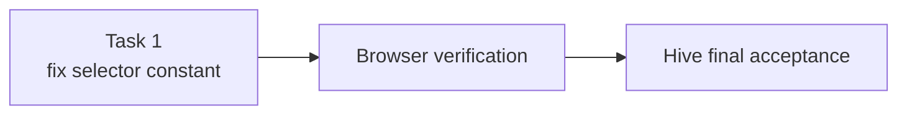

# fix-stagger-selector — Repair the invalid stagger child selector

## Overview / Design Summary

One root cause, one constant, four call sites. `Project Files/assets/js/animation-observer.js:25` defines:

```js
const STAGGER_CHILD_SELECTOR = '> *';
```

A **leading combinator is not a valid standalone selector** for `Element.querySelectorAll()` — it throws `SyntaxError`. A relative selector is only legal when it is `:scope`-relative. Changing the single constant to `':scope > *'` repairs all four usages (lines 83, 146, 200, 206) with no other edit.

This is a **Simple Implementation**: isolated, single file, root cause proven by reproduction.



---

## 1. Objective

Eliminate the uncaught `SyntaxError` thrown on every core page and restore the broken stagger-reveal behaviour, without changing any animation's intended appearance.

## 2. Problem Definition (Root Cause)

`> *` is a *relative* selector. The CSS selector grammar only allows a leading combinator when the selector list is anchored, i.e. `:scope > *`. Passing `'> *'` directly to `querySelectorAll` fails the selector parse and throws.

The faulty constant is dereferenced in four places:

| Line | Function | Context |
|------|----------|---------|
| 83 | `applyStaggerAnimation` | `IntersectionObserver` path |
| 146 | `initAnimationObserver` | `prefers-reduced-motion` branch |
| 200 | `triggerStaggerAnimation` | reduced-motion branch |
| 206 | `triggerStaggerAnimation` | main path |

## 3. Evidence (reproduced, not inferred)

Measured in the live browser on `Project Files/index.html`:

- `container.querySelectorAll('> *')` → `SyntaxError: Failed to execute 'querySelectorAll' on 'Element': '> *' is not a valid selector.`
- `container.querySelectorAll(':scope > *')` → **2** (correct — matches the two injected cards)
- `container.children.length` → **2** (equivalent result via the children API)
- Console stack traces confirm **two** escape routes:
  - `applyStaggerAnimation (animation-observer.js:83)` ← `IntersectionObserver.handleIntersections (111/119)`
  - `triggerStaggerAnimation (animation-observer.js:206)` ← `renderFeaturedProjects (data-loader.js:39)`
- `#featured-projects` **never** receives `is-visible`, both before and after scrolling a full page height → the stagger reveal is entirely non-functional.
- Counter-check (avoided a false positive): the four `[data-animate]` sections show `opacity: 0` before scrolling but all reach `opacity: 1` after scrolling. That is **correct, intended scroll-reveal behaviour** — it is **not** a bug and must not be "fixed".

## 4. Confirmed Requirements

- R1: `STAGGER_CHILD_SELECTOR` must be a valid selector for `Element.querySelectorAll()`.
- R2: Semantics must remain "direct element children of the container" (equivalent to the previous intent).
- R3: All four call sites must be repaired — changing only the constant is preferred over editing each call site.
- R4: No change to animation classes, delays, durations, easing, or CSS.
- R5: No change to any other file.

## 5. Technical Approach

Change one line:

```js
const STAGGER_CHILD_SELECTOR = ':scope > *';
```

`:scope` is supported in all browsers this site targets and preserves `NodeList.prototype.forEach` usage at every call site, so no call-site edits are needed. `container.children` was considered and rejected only because it would require wrapping each of the four usages in `Array.from(...)`, producing a larger diff for the same result.

## 6. Files / Components

| File | Change |
|---|---|
| `Project Files/assets/js/animation-observer.js` | line 25 — constant value only |

No other file is touched. `data-loader.js` is **not** modified; it is repaired transitively because it calls `AnimationObserver.triggerStagger`.

## 7. Out of Scope

- Any other console error: `assets/images/hero-poster.jpg` 404, the hero mp4 `ERR_ABORTED`, and the `__livereload` 404.
- The reduced-motion coverage gap in `animations.css` (`.card-entrance`, `.animate-stagger`, `.hero-animate-*`, `.list-animate` are not neutralised). This fix only stops the reduced-motion branch from *throwing*.
- `demos/project1/README.html` missing its `markdown.css` link.
- Refactoring the duplicated inline `animation-delay` in `data-loader.js` templates.

## 8. Acceptance Criteria

- AC1: `animation-observer.js` contains no `'> *'` literal; the constant is `':scope > *'`.
- AC2: No `SyntaxError` from `animation-observer.js` in the console on `index.html`, `about.html`, `contact.html`, or `projects.html`.
- AC3: After scrolling `index.html` to the featured-projects section, `#featured-projects` has class `is-visible`.
- AC4: On `projects.html`, `#project-list` receives `is-visible` and its `.project-item` children carry staggered inline `animation-delay` values (0ms, 100ms, …).
- AC5: `git diff` touches exactly one file and one line.
- AC6: No visual regression: the hero animations and the four `[data-animate]` section reveals still behave as before.

## 9. Verification Requirements

Browser (served at `http://127.0.0.1:3000/`, document root = repo root):
- V1: load `index.html`, capture the console — assert **zero** `SyntaxError` entries referencing `animation-observer.js`.
- V2: scroll `index.html` through the whole page; assert `#featured-projects` `is-visible === true`, and that its card children have non-empty inline `animationDelay`.
- V3: repeat V1/V2 on `projects.html` for `#project-list`.
- V4: repeat V1 on `about.html` and `contact.html`.
- V5: assert the four `[data-animate]` sections still reach `opacity: 1` after scrolling (regression guard).
- V6: assert hero `.hero-animate-title` / `.hero-animate-description` still animate (regression guard).

Static:
- V7: `grep` for `'> *'` in `assets/js/` returns no matches; `:scope > *` present exactly once.
- V8: `git diff --stat` shows exactly 1 file changed, 1 insertion, 1 deletion.

Any failure → stop and report evidence; do not self-remediate beyond this plan.

---

## Tasks

### 1. Fix the invalid stagger child selector

In `Project Files/assets/js/animation-observer.js`, change line 25 from
`const STAGGER_CHILD_SELECTOR = '> *';` to `const STAGGER_CHILD_SELECTOR = ':scope > *';`.
Change nothing else — no call-site edits, no CSS edits, no other file. Then run verification V1–V8 and report the observed evidence for each.

Acceptance: AC1–AC6; V1–V8.
